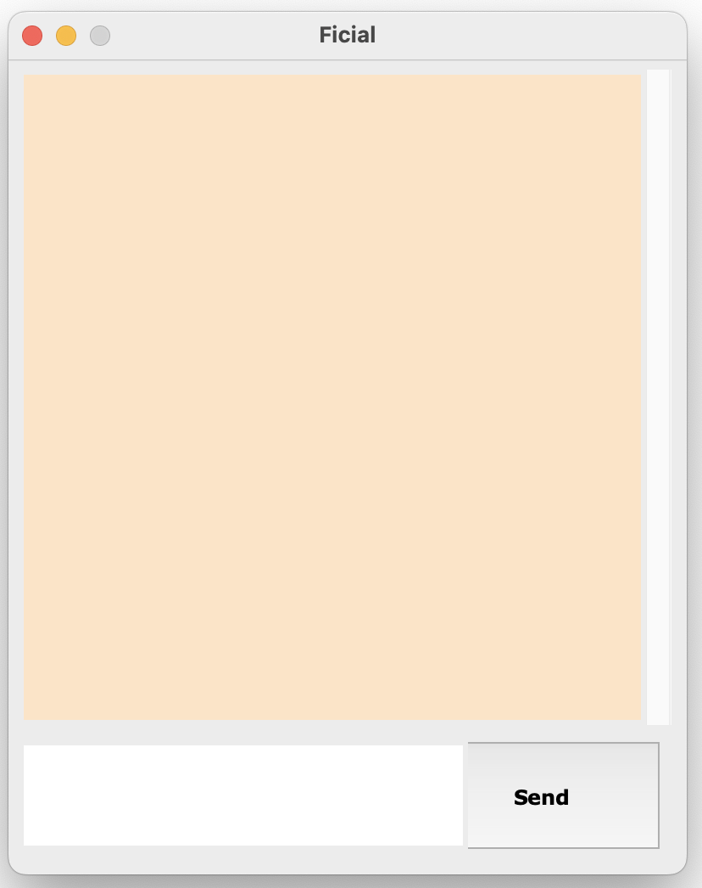
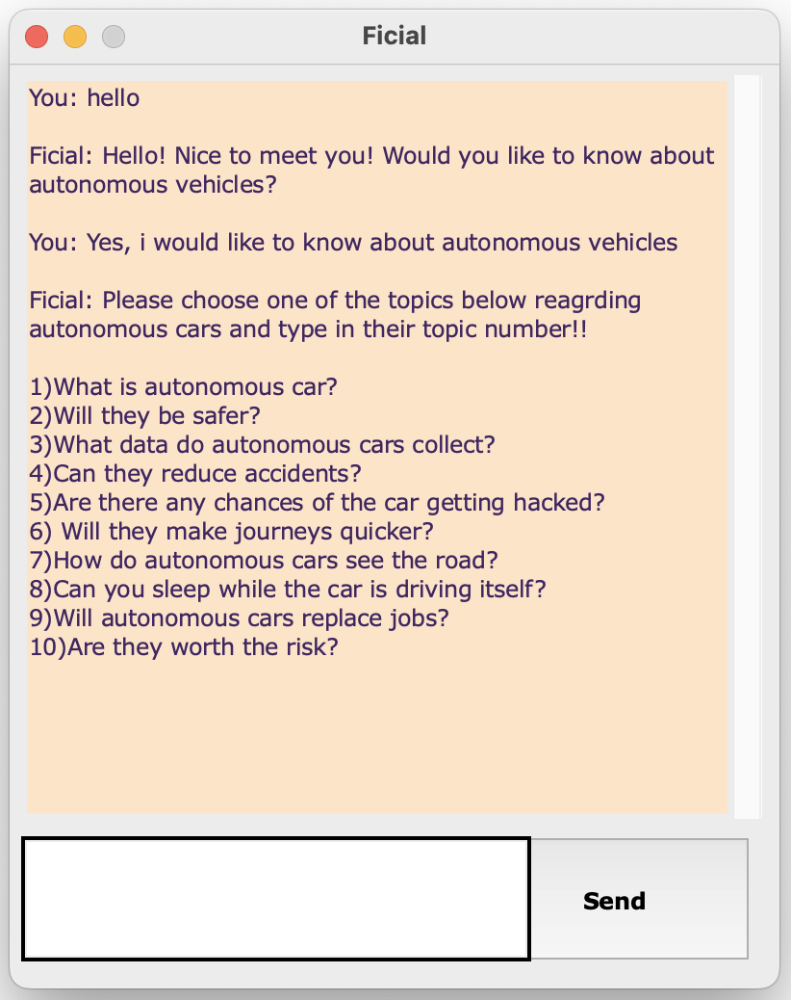
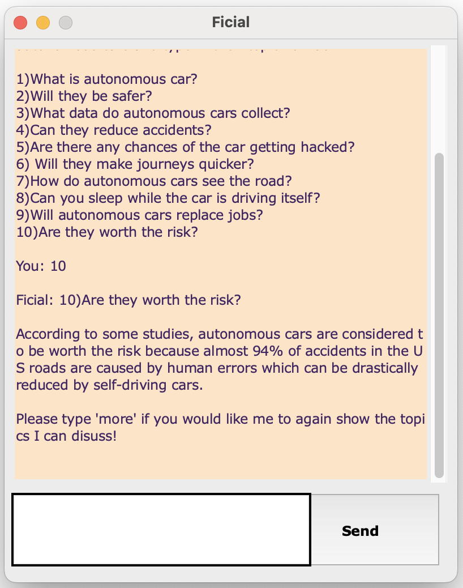
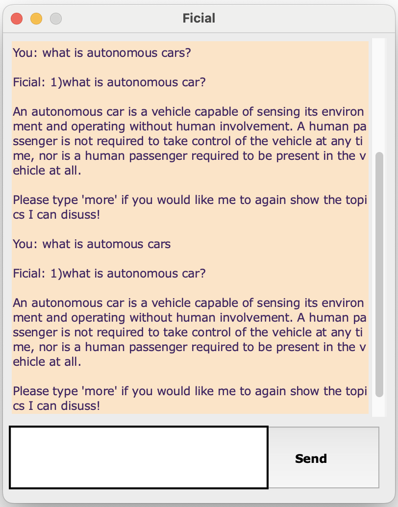

# 🤖 Rule-Based Python Chatbot

This is a rule-based Python chatbot developed for my MSc Artificial Intelligence dissertation at Manchester Metropolitan University. The chatbot, named "Ficial", is designed to discuss and simulate conversations around trust in AI systems, with a specific focus on autonomous vehicles.

It helps users explore ethical questions such as:

Are autonomous cars safe?

Can they be hacked?

Will they replace jobs?

Can you sleep while the car drives?

The goal is to educate users and stimulate critical thinking about trust in AI.

---

## 🔍 Key Features

- Rule-based response engine using Python and JSON
- GUI built with Tkinter for chat interaction
- Answers 10+ real-world questions about trust in autonomous cars
- Handles common input variations and spelling errors
- Provides introductory conversation flow and user-friendly messages

---

## 🎯 Project Purpose

The chatbot was built as part of a dissertation project to explore how AI systems, specifically autonomous vehicles, can earn public trust. The aim was to:

- Simulate a realistic Q&A dialogue around AI ethics and reliability
- Reflect public concerns about AI in a user-friendly way
- Collect conversational feedback from test users for evaluation

---

## ⚙️ How It Works

- A **rule-based logic engine** parses user input and matches it with intents from a `JSON` knowledge base.
- The chatbot uses **Natural Language Toolkit (NLTK)** for basic NLP processing (like lemmatization).
- A trained model classifies the user’s message and selects an appropriate response.
- A simple **Tkinter-based GUI** allows users to interact via a chat interface.

---

## ✅ Evaluation & Testing

- The chatbot was evaluated through a user testing study with real participants.
- Feedback showed the bot was able to answer key questions about autonomous vehicles and trust in AI effectively.
- Improvements were noted based on user experience, such as typo tolerance and conversational flow.

---

## 🚀 Getting Started

Follow the steps below to run the project locally:

---
### 1. Clone the Repository

git clone https://github.com/Adolph1999v/Chatbot.git

### 2. Open the Terminal

cd Desktop/Chatbot

### 3. Install the packages

pip install flask

pip install nltk

### 4. Run the chatbot

python chatbot.py

- Wait for the chatbot to popup (might take few seconds)

## 🖼️ Chatbot Preview

